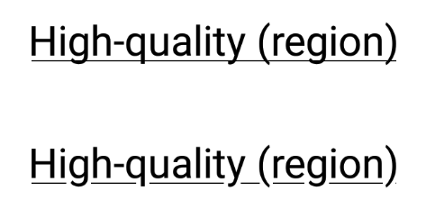
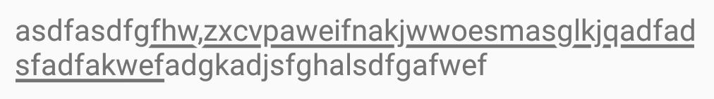

ElegantUnderlineSpan implement based on romain guy's article [better underline for android](https://medium.com/@romainguy/a-better-underline-for-android-90ba3a2e4fb#.tyhk99ywj) and repo [elegant-underline](https://github.com/romainguy/elegant-underline)



here's what it looks like 

notice that this span extends LeadingMarginSpan, the start of the span must be set to 0, otherwise the drawLeadingMargin method will not be call, so here's how you should use this span:

```
SpannableString ss = new SpannableString("what a lovely day!lalalalala");

//this is where you set the real span start and span end
ElegantUnderlineSpan underlineSpan = new ElegantUnderlineSpan(5, 20, 5);

//span must start at 0
ss.setSpan(underlineSpan, 0, 1, Spanned.SPAN_EXCLUSIVE_EXCLUSIVE);

```

